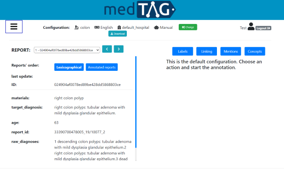
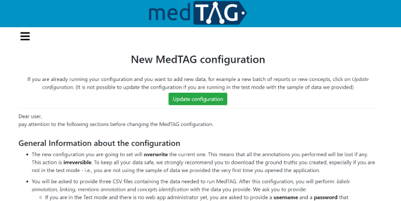

# MedTAG version 1.0.5


MedTAG: An open-source biomedical annotation tool for diagnostic reports.

This repository contains the full source code of MedTAG, a biomedical annotation tool for tagging biomedical concepts in clinical reports.

MedTAG provides four annotation types:

- *Concepts*: allows the user to specify which concepts are relevant for a document. Users can take advantage of auto-complete functionalities for searching the relevant concepts to assign to each document. 

- *Labels*: allows the user to assign, by clicking on the check-boxes, one or more labels to a document. The labels indicate some reports' properties (e.g. "*Cancer*" label indicates the presence of a cancer related disease).
- *Mentions*: shows the list of the mentions identified by the user in the report text. 
- *Linking*: allows the user to link the mentions identified with the corresponding concepts. Users can link the same mention to multiple concepts.


## Functionalities

MedTAG provides the following functionalities:

- a web-based collaborative annotation platform with support for users and roles 
- support for click-away mention annotation
- support for mentions highlighting in different colors
- automatic saving every time an action is performed
- sorting of medical reports according to two different strategies: lexicographic order
  and “unannotated-first” policy
- web responsive design to support mobile devices
- download of annotations and ground truths in several formats (i.e., BioC/XML, CSV, JSON)
  

- support for multi-label annotation
- support for document-level annotations
- multilingual support
- support for ontologies/concepts to use for the annotation process
- support for schema configuration, so that users can easily import data (i.e., reports, labels and concepts), as CSV files, and choose which report fields to annotate.
- support for automatic annotation of all the annotation types for reports belonging to three use cases: colon, uterine cervix and lung. Automatic annotation is available for english reports 
- support for annotation of PubMed articles
- support for visualization of report's annotations
  

- support for inter-annotator agreement
  

- support for the upload and visualization of other team members' ground-truths
  

## Files

The directory tree is organized as follows:

- The *MedTAG_Dockerized* directory contains the full source code of MedTAG.
- The *example* directory contains some instances of CSV files to work with.
- The *templates* directory contains some instances of CSV files with only the list of header columns.  
- The *img* directory contains the project images such as the screeenshots of MedTAG. 

 

# Requirements

Since MedTAG is provided as a Docker container, both [docker](https://docs.docker.com/engine/reference/commandline/docker/) and [docker-compose](https://docs.docker.com/compose/) are required. To this aim, check out the [installation procedure](https://docs.docker.com/get-docker/) for your platform. Moreover, the MedTAG docker container instantiates a [PostgreSQL](https://www.postgresql.org/) database, so if you plan to insert a large amount of data make sure you have enough disk space. For what concerns the browser choice, Chrome would be the best browser to work with MedTAG. Nevertheless, both Safari and Firefox are supported as well.


# Installation
If you already have both [docker](https://docs.docker.com/engine/reference/commandline/docker/) and [docker-compose](https://docs.docker.com/compose/) installed on your machine, you can skip the first two steps.

1. Install Docker. To this aim, check out the correct [installation procedure](https://docs.docker.com/get-docker/) for your platform.

2. Install Docker-compose. As in the first step, check out the correct [installation procedure](https://docs.docker.com/compose/install/) to get [docker-compose](https://docs.docker.com/compose/) installed for your platform.

3. Check the Docker daemon (`dockerd`)  is up and running.

4. Download or clone the [medtag-core](https://github.com/MedTAG/medtag-core) repository.

5. Open MedTAG_Dockerized/baseurl.txt file and put the baseURL of the server where MedTAG is deployed. If the server hosting MedTAG has the baseURL http://example.com/server/example/, specify this URL in place of the http://0.0.0.0:8000/ provided by default.

6. Open the [MedTAG_Dockerized](https://github.com/MedTAG/medtag-core/tree/main/MedTAG_Dockerized) project folder and, on a new terminal session, type ```docker-compose up```. After running the latter command the installation of MedTAG dependencies is performed and the following output will be generated:

   

   **NOTE**: In Unix-like systems `docker-compose` should be run  without using `sudo` in a directory owned by the user.

7. MedTAG installation has completed and you can access it on your browser at http://0.0.0.0:8000/.

**NOTE**: If you want to shut down MedTAG, open a new terminal window and navigate to the project folder. Finally type `docker-compose down`

**NOTE**: If you want to redo the whole installation process and run MedTAG in *Test Mode* (i.e., with the provided sample data) open a new terminal and, inside the project folder, run the following commands: 

   1. `docker-compose down`
   2. `sudo rm -rf data`
   3. `docker image ls`
   4. Then select the IMAGE ID of the image whose name is *medtag dockerized web* and run: `docker image rm <IMAGE ID>`
   5. Finally run `docker-compose up`
 
 **NOTE**: If you are running docker in operating systems like CentOS and the installation can not terminate due to errors related to Cython, you can install MedTAG with a different `Dockerfile` and `docker-compose.yml` files based on Ubuntu:20.04 OS. These files can be found at: `medtag-core/docker_config_ubuntuOS/`. Copy the `Dockerfile` and the `docker-compose.yml` files in: `medtag-core/MedTAG_Dockerized` and make sure these files overwrite the existing ones. Stop the container, remove the images related to the previous installation process that threw the errors and redo the entire installation.

# Getting started

## Test Mode

The following procedure describe how to start using MedTAG in _Test Mode_, which allows you to try MedTAG with the pre-loaded dataset of reports. If you want to load and work with your own reports, you have to proceed with the following steps anyway and then jump to the _Customize MedTAG_ section.

1. Open a new browser window and go to: http://0.0.0.0:8000/, you will see the MedTAG web interface.

2. Log into MedTAG using "Test" both as username and password. In this way, you will enter in MedTAG using the _Test Mode_ that allows you to try MedTAG features using a sample of data we provided.

   

3. Once you have logged in, you will be asked to provide a first reports configuration. In particular, you have to provide:

   1. **Report type**: this can be *MedTAG Reports* and it indicates the reports the administrator uploaded or *PubMed articles* and it indicates the PubMed articles you uploaded giving their ID.

   2. **Language**: this is the language of the reports you will annotate.

   3. **Use case**: this is the use case of the clinical reports (e.g. Colon cancer and Lung cancer).

   4. **Institute**: this is the medical institute which provides the diagnostic reports.

   5. **Annotation mode**: This can be _Manual_ if the user creates the ground truths from scratch, or _Automatic_ if the user edits the ground truths automatically created. _Automatic_ option is available if there are some automatically created ground truths.

      **NOTE**:  In  _Test Mode_ you can annotate a set of reports about colon we provided (this corresponds to the following combination: MedTAG reports, English, colon, default_hospital, Manual), or a set of PubMed articles (this corresponds to: PubMed articles, colon, Manual). Note that if you select PubMed articles you do not need to set *language* or *institute* because they are set by default.


## Customize MedTAG

In order to customize MedTAG with your own data, you need to provide three CSV files (i.e, *reports_file*, *concepts_file*, *labels_file*). Please, **make sure to use a comma as separator** for your CSV files. Furthermore, **make sure to escape values that contains commas**.

### CSV files needed:

- **reports_file**: this file contains the clinical reports to annotate. The csv header must contain the following columns:

  1. **id_report**: the report unique identifier.

  2. **language**: the language adopted for the report textual content.

  3. **institute**: the health-care institute which provides the diagnostic reports.

  4. **usecase**: the report use-case (e.g. colon cancer) indicates the clinical case the report refers to.

     **NOTE**: if you are not interested in providing either the *institute* or the *usecase* you can assign them a default value of your choice, that holds for all the rows of the *reports_file*.

     

     **NOTE:** In addition to the previous mandatory columns, you need to provide a set of additional columns to describe the actual textual content of your reports (e.g. the diagnosis text, the patient information and so on). You can specify as many columns as you want.
     
- **pubmed_file**: this file contains the PubMed articles to annotate. The csv header must contain the following columns:

  1. **ID**: the PubMed article's unique identifier.

  2. **usecase**: the article's use-case (e.g. colon cancer) indicates the clinical case the report refers to.

     **NOTE**: if you are not interested in providing the *usecase* you can assign it a default value of your choice, that holds for all the rows of the *pubmed_file*. 
   
     **NOTE**: the language considered for PubMed articles is: English.

     **NOTE**: PubMed articles are uploaded with a rate of 3 articles per second.
     
     

- **concepts_file**: this file contains the concepts used for annotating the clinical reports. All the concepts must be identified with a *concept_url* which uniquely identifies the concept according to a reference ontology. The csv header must contain the following columns:

  1. **concepts_url**: the URL of the concept in the reference ontology.

  2. **concepts_nome**:  the name of the concept the concept url points to.

  3. **area**: this is a category associated to the concept.

  4. **usecase**: the concept use-case (e.g. colon cancer) indicates the clinical case the concept refers to.

     **NOTE**: if you are not interested in providing either the _area_ or the *usecase* you can assign them a default value of your choice, that holds for all the rows of the *concepts_file*. It is worth noting that the _usecase_ provided for the concepts should be coherent with the one provided for the reports.

     

- **labels_file**: this file contains the labels used for annotating the clinical reports. The labels describe a diagnostic property of a clinical report. For instance,  the "Cancer" label describe the presence of a cancer-related disease. The csv header must contain the following columns:

  1. **label**: the label text.

  2. **usecase**:  the label use-case (e.g. colon cancer) indicates the clinical case the concept refers to.

     **NOTE**: if you are not interested in providing the *usecase* you can assign it a default value of your choice, that holds for all the rows of the _labels_file_.

     

### Data configuration

The following procedure describe how to configure MedTAG in order to load your own reports and work with them in MedTAG. It is worth noting that only the admin user has the privileges to change the MedTAG configurations. Moreover, **every time a new configuration is provided the previous one will be overwritten, thus data and annotations will be removed as well**.   

To start a new configuration follow the instructions below:

1. Open the Menu from the _Test Mode_ and go to _Configure_.

   

   

2. Read and follow the instructions of the guided procedure.

   

3. Provide the CSV files.

   **NOTE**: You can add one or more files from the same folder. If it is the first time you configure MedTAG, you are asked to provide both the username and the password that will be used by the admin user to login into MedTAG. The admin user is the only one who can change the configuration files and access the data. If you do not have access to _Configure_ section (i.e., you do not see it in the side bar), this means that you are not logged in as the admin user.

   **NOTE**: It is mandatory to upload at least one file between ***reports_file*** and ***pubmed_file***. Once you uploaded one or more **reports_file**, MedTAG automatically detects the columns which characterize your report and asks you to choose which fields of the report you want to hide, display or annotate. **You need to set at least one field to be displayed**.  If you uploaded one or more **pubmed_file** instead, you do not have to to set any field to be displayed or annotated: *abstract* and *title* are annotable by default, while *volume*, *journal*, *year*, *authors* are only displayed.

   **NOTE**: The *concepts_file* and _labels_file_ and are not mandatory. This means that if you are not interested in labels annotation and/or concepts identification you can avoid to provide them. By the way,  you must provide either the _labels_file_ or the *concepts_file* or set at least one field to *Display* and *Annotate*.

   
   
    **NOTE**: If you uploaded the ***reports_file*** or the ***pubmed_file*** giving *Colon, Uterine cervix* or *Lung* as use-cases, you can rely on a set of concepts and labels we provide, without uploading your own ones. Remember that it is not allowed to upload new concepts (or labels) if you decided to rely on those we provide. 

4. Check the format of the provided CSV files, by clicking on the *Check* button. Then, the automatic procedure will produce some state messages in different colors:

     - Green: messages in green color (i.e., success messages)  mean that the provided CSV files are well-formatted.

     - Orange: messages in orange color (i.e., warning messages) mean that you **should revise the format of the provided CSV files**. Nevertheless, the provided CSV files are accepted anyway.

     - Red: messages in red color (i.e., error messages) mean that you **must revise the format of the provided CSV files**, since they are not well-formatted. Error messages provide information about the errors occurred and suggest the user how to fix the issues.

       

5. When the procedure has ended, a notification of success or error will be provided. If you provided reports (or PubMed articles) whose use-cases are: *Colon, Uterine cervix* or *lung* you will be notified that automatic annotation is available. This operation can be time consuming, hence you can decide to automatically annotate your reports or log in and start the automatic annotation process in another moment. If you want to automatically annotate your reports you have to select the fields you want to extract the concepts, the mentions and the labels from. In case of successful configuration of MedTAG, the login page will look like the screenshot below. 

   

### Update data configuration

The following procedure describe how to provide additional data to the current configuration of MedTAG. Updating the configuration is possible only if you are not running MedTAG with the sample data we provided, that is, MedTAG is not running in *Test Mode*. In order to update a configuration follow these steps:

1. Open the Menu and go to *Configure* and click on *Update configuration*.

2. Select what you want to update. You can add some reports, labels or concepts. You can also change the fields to display and annotate. If you want to update the fields to annotate and display, remember that you cannot set to *Hide* or *Display* the fields you previously decided to annotate, since this would affect the annotations that rely on those fields.

   **NOTE**: If you decide to add reports having columns that MedTAG has never detected before, you will be asked to choose what columns to display, hide or annotate.
 
3. In this page you can also automatically annotate your reports whose use-cases are: *Colon, Uterine cervix* or *Lung* (if any). You can decide for each use-case what fields you want to extract concepts, labels and mentions from. This process might be time and memory consuming, this is why we recommend you to have machines powerful enough (see **requirements** section) to perform this task. 

   **NOTE**: If you want to automatically re-annotate reports belonging to a use-case, all the ground-truths previously automatically created for that use-case will be removed. The same holds for the automatic annotation of PubMed articles.

   
   
   # MedTAG Benchmark 

MedTAG annotation performance has been assessed by means of an automatic agent, which simulated the annotation process for two specific use-cases: 

1. **document-level annotation**: this task concerns the annotation of documents with labels that describe the overall document content.
2. **mention-level annotation**: this task concerns the identification of concept-related mentions, in the documents' textual content.

The annotation process performance has been evaluated in terms of:

1. **number of actions**: number of user-required actions (e.g. clicks and keys pressed) to annotate documents according to the use-cases specified.
2. **time elapsed**: the amount of time required to perform the whole annotation process (i.e. all the sample documents considered get annotated).

The analysis we conducted considers a sample of one hundred documents, randomly chosen from a real dataset concerning the digital pathology domain (i.e. colon cancer clinical reports). We assessed the performances of MedTAG and other annotation tools including [ezTag](https://eztag.bioqrator.org/), [MyMiner](https://myminer.armi.monash.edu.au/) and [tagtog](https://www.tagtog.net/). We measured the number of actions and the time elapsed for each annotation tool. We computed the mean and the standard deviation over forty trials.

The experiment results are summarized in the following tables:

**Table 1**: **document-level annotation** performance analysis

|                                            Tool | #Actions | Elapsed time in seconds (mean) | Standard deviation in seconds |
| ----------------------------------------------: | :------: | :----------------------------: | :---------------------------: |
| [MedTAG](https://github.com/MedTAG/medtag-core) |   200    |             46.84              |             0.803             |
|  [MyMiner](https://myminer.armi.monash.edu.au/) |   100    |             56.677             |             0.416             |
|               [tagtog](https://www.tagtog.net/) |   400    |             205.74             |             5.471             |


**Table 2**: **mention-level annotation** performance analysis

|                                            Tool | #Actions | Elapsed time in seconds (mean) | Standard deviation in seconds |
| ----------------------------------------------: | :------: | :----------------------------: | :---------------------------: |
| [MedTAG](https://github.com/MedTAG/medtag-core) |   519    |            159.337             |             0.479             |
|           [ezTag](https://eztag.bioqrator.org/) |   307    |             260.34             |             0.576             |
|             [teamTat](https://www.teamtat.org/) |   307    |            271.577             |             1.542             |
|               [tagtog](https://www.tagtog.net/) |   404    |            304.692             |            10.067             |
|  [MyMiner](https://myminer.armi.monash.edu.au/) |   414    |            114.390             |             1.507             |


## Technical details 

### Datasets

The datasets considered for the benchmark experiments consist of a sample of one hundred documents from the digital pathology domain (i.e. colon cancer clinical reports anonymized). The datasets are available inside the folder [datasets](https://github.com/MedTAG/medtag-core/tree/main/benchmark/datasets)

### Source code

The benchmark experiments have been conducted using the Python Web automation library [Selenium](https://www.selenium.dev/). The full source code of the automated agents implemented is available inside the folder [automated_agents_selenium](https://github.com/MedTAG/medtag-core/tree/main/benchmark/automated_agents_selenium). 

# Credits

MedTAG has been developed by the [Intelligent Interactive Information Access Hub (IIIA)](http://iiia.dei.unipd.it/) of the  [Department of Information Engineering](https://www.dei.unipd.it/en/), [University of Padua](https://www.unipd.it/en/), Italy.


## Acknowledgements 


This work was partially supported by [ExaMode](https://www.examode.eu/), European Union Horizon 2020 program under Grant Agreement no. 825292.

## Contacts

Any questions? The authors are glad to answer your questions and receive your feedback or suggestions to further improve MedTAG. 

- [Fabio Giachelle](http://www.dei.unipd.it/~giachell) · fabio.giachelle AT unipd.it
- [Ornella Irrera](http://www.dei.unipd.it/~irreraorne) · ornella.irrera AT unipd.it
- [Gianmaria Silvello](http://www.dei.unipd.it/~silvello/) · gianmaria.silvello AT unipd.it
